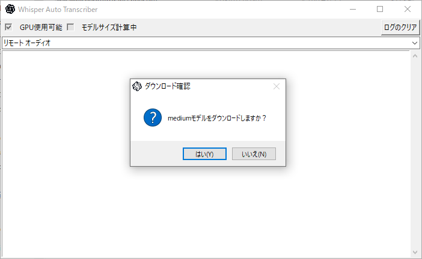
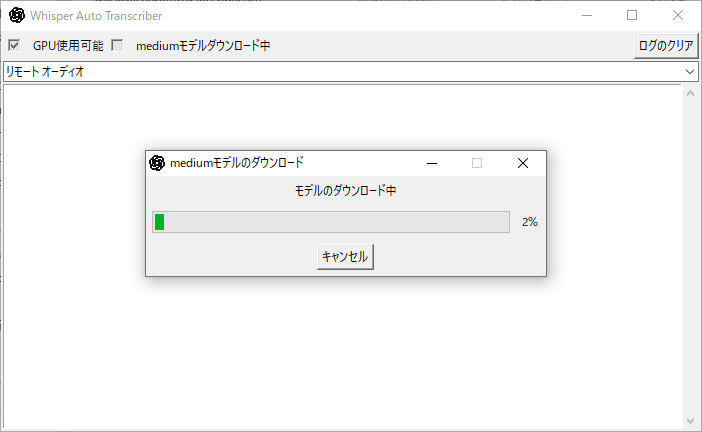
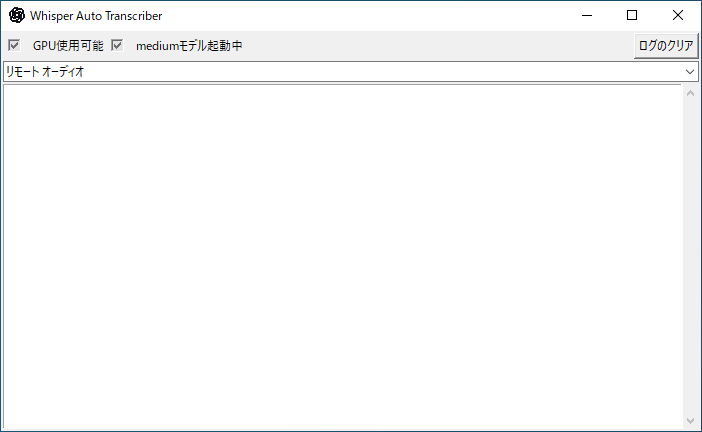

# WhisperAutoTranscriber

Whisper(OpenAI)を利用したPC音声の文字起こしツールです。CUDAが使用できる場合はGPUでの動作も可能です。

モデルサイズなどは最適なものを自動で選択してくれます。

11GB以上のGPUメモリがあれば、Largeモデルが動くはずです。

## インストール方法

ReleaseからWhisperAutoTranscriber.7zをダウンロードして、解凍してください。

## 実行方法

解凍したフォルダ内にあるWhisperAutoTranscriber.exeを実行する。

## 実行環境

Windows10, GPU推論を行いたい場合はCUDAが動作するNVIDIA GPU(GTX 1000番以降のものならいけるはず)

## 実行画面

### モデルダウンロードの確認

### モデルダウンロード中

### 推論実行中

